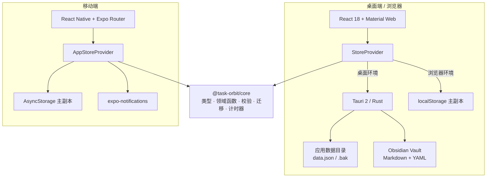

<div align="center">
  

  # Task Orbit

  **本地优先的个人任务、日程与专注管理应用**

  用项目组织目标，用任务拆解行动，用每日计划安排时间，再通过番茄钟和统计回顾投入。

  [](https://v2.tauri.app/)
  [](https://react.dev/)
  [](https://expo.dev/)
  [](https://www.typescriptlang.org/)
  [](https://pnpm.io/workspaces)
</div>

> [!NOTE]
> Task Orbit 目前处于早期开发阶段（`v0.1.0`）。数据结构、界面和打包方式仍可能调整，升级或尝试新版本前建议先导出快照。

## 为什么是 Task Orbit？

很多任务工具擅长记录“要做什么”，却把项目进度、具体时间安排和实际专注记录拆散在不同位置。Task Orbit 希望提供一条连续的个人工作流：

```text
快速收集 → 建立项目 → 拆分任务 → 安排每日计划 → 专注执行 → 回顾统计
```

应用不依赖账号或云服务，核心数据保存在本机；桌面端还可以把项目笔记直接写入 Obsidian Vault，便于长期保留和自由迁移。

## 功能概览

### 收件箱

- 随手记录待办或纯文本笔记，不必先决定所属项目。
- 支持编辑、完成待办和删除条目，适合作为后续整理的临时入口。

### 项目、任务与每日计划

- 以“项目 → 任务 → 每日计划”组织工作，也可以创建不属于任何项目的独立计划。
- 为项目设置描述、起止日期和主题色，为任务设置日期范围与高、中、低优先级。
- 每日计划包含具体日期、起止时间和预计时长，可按天、周或月批量创建重复计划。
- 查看项目概览、任务/计划完成率、剩余天数与专注投入。
- 支持项目归档、恢复和永久删除；历史番茄钟记录保留名称快照，避免删除实体后统计失去上下文。

### 日历

- 日、周、月三种主视图。
- 周视图可在任务甘特图与每日计划时间轴之间切换。
- 自动处理同一时段内重叠计划的分栏布局。
- 从月视图或周视图快速进入某一天，并在日视图中查看和编辑时间块。

### 番茄钟

- 可配置专注、短休息、长休息时长以及长休息间隔。
- 支持开始、暂停、跳过和重置，并可关联到项目、任务或每日计划。
- 计时状态持久化；应用恢复焦点或重新打开时会自动对账已结束的阶段。
- 移动端使用系统本地通知提醒计时结束（Web 环境除外）。

### 统计

- 汇总今日与本周番茄数、任务完成率和计划完成率。
- 展示近 7 天专注时长趋势。
- 按项目统计专注投入，保留已删除项目的历史名称。

### Obsidian Vault 笔记（桌面端）

- 连接已有 Vault，或在指定目录中创建新的 Vault。
- 在项目内创建、编辑、置顶、扫描和删除 Markdown 笔记。
- 使用 YAML frontmatter 保存笔记 ID、项目、任务与每日计划关联。
- 基于内容哈希检测外部修改，避免静默覆盖在 Obsidian 中发生的更改。
- 可通过 `obsidian://` 链接在 Obsidian 中打开对应笔记。

### 数据与外观

- 浅色、深色和跟随系统三种主题，桌面端与移动端均遵循 Material Design 3 的色彩层级。
- 导出可迁移的 JSON 工作区快照，并在导入前完成格式校验和数据迁移。
- 导出会主动移除正在运行的计时器以及本机 Vault 路径，避免携带机器相关信息。
- 所有状态变更都经过 Zod 校验；无效实体关系不会被写入持久化存储。

## 平台与能力

| 能力 | Tauri 桌面端 | 浏览器预览 | Expo 移动端 |
| --- | :---: | :---: | :---: |
| 收件箱、项目、任务、每日计划 | ✅ | ✅ | ✅ |
| 日 / 周 / 月日历 | ✅ | ✅ | ✅ |
| 番茄钟与统计 | ✅ | ✅ | ✅ |
| 本地持久化与备份 | `data.json` | `localStorage` | `AsyncStorage` |
| 番茄钟系统通知 | — | — | ✅（iOS / Android） |
| Obsidian Vault 笔记 | ✅ | — | — |
| JSON 导入 / 导出 | ✅ | ✅ | ✅ |

> 浏览器模式主要用于开发和界面预览。它无法访问本机 Vault，也不等同于桌面安装包。

## 技术架构

Task Orbit 使用 pnpm monorepo，让桌面端和移动端共享一套纯 TypeScript 领域模型，同时为不同平台保留各自的 UI、持久化和系统能力。



### 核心设计

1. **单一状态模型**：`AppState` 是应用数据的唯一事实来源，包含项目、任务、计划、收件箱、专注记录、设置和活动计时器。
2. **纯函数变更**：共享包中的领域函数接收旧状态并返回新状态，UI 不直接修改数据。
3. **写入前校验**：每次变更后用 Zod 同时验证记录形状与跨实体引用完整性，校验失败时保留旧状态。
4. **版本化迁移**：持久化数据带有严格版本号；旧数据加载时逐级迁移到当前结构（当前状态版本为 `6`）。
5. **可靠持久化**：桌面端使用临时文件、`fsync`、备份轮换和原子替换；浏览器与移动端维护主、副两份数据并支持损坏恢复。
6. **克制的计时写入**：显示层可以高频刷新倒计时，但只有状态变化和计时对账才写入磁盘。

### 技术栈

| 层级 | 技术 |
| --- | --- |
| 桌面 UI | React 18、TypeScript、Vite、Material Web Components、`@lit/react` |
| 桌面壳与本机能力 | Tauri 2、Rust 2021、Serde / Serde JSON / Serde YAML |
| 移动端 | React Native、Expo SDK 57、Expo Router、React Native Reanimated |
| 共享核心 | TypeScript、Zod 4、纯函数领域逻辑 |
| 数据存储 | Tauri 文件持久化、Web Storage、AsyncStorage |
| 测试 | Vitest、Rust 内联单元测试 |
| 工作区 | pnpm workspace |

## 快速开始

### 环境要求

- [Node.js](https://nodejs.org/)（建议使用当前 LTS 版本）
- [pnpm](https://pnpm.io/installation)
- 构建桌面端时需要 [Rust stable](https://www.rust-lang.org/tools/install) 及对应平台的 [Tauri 2 系统依赖](https://v2.tauri.app/start/prerequisites/)
- 运行移动端时需要 Expo 支持的 Android / iOS 开发环境；本地运行 iOS 模拟器需要 macOS

### 安装依赖

```bash
git clone <your-fork-or-repository-url>
cd TaskOrbit
pnpm install
```

仓库目前未配置公开远程地址，因此请将上面的占位地址替换为实际仓库 URL。

### 启动桌面端

完整 Tauri 应用（包含文件持久化与 Obsidian Vault 功能）：

```bash
pnpm tauri dev
```

仅启动 Vite 浏览器预览（固定地址 `http://localhost:1420`）：

```bash
pnpm dev
```

### 启动移动端

```bash
pnpm mobile
```

也可以直接运行原生目标：

```bash
pnpm mobile:android
pnpm mobile:ios
```

## 常用命令

| 命令 | 说明 |
| --- | --- |
| `pnpm dev` | 启动 Vite 浏览器开发服务器 |
| `pnpm tauri dev` | 启动完整桌面应用 |
| `pnpm build` | 检查共享核心、移动端和桌面端类型并构建桌面前端 |
| `pnpm tauri build` | 构建并打包桌面应用 |
| `pnpm test` | 单次运行全部前端测试 |
| `pnpm mobile` | 启动 Expo 开发服务器 |
| `pnpm mobile:android` | 在 Android 模拟器或设备运行移动端 |
| `pnpm mobile:ios` | 在 iOS 模拟器运行移动端 |
| `pnpm mobile:check` | 检查移动端 TypeScript 类型 |
| `cargo check --manifest-path src-tauri/Cargo.toml` | 检查 Rust 桌面端代码 |
| `cargo test --manifest-path src-tauri/Cargo.toml` | 运行 Rust 测试 |

## 目录结构

```text
TaskOrbit/
├─ apps/
│  └─ mobile/                 # Expo / React Native 移动端
├─ packages/
│  └─ core/                   # 跨平台类型、领域逻辑、校验、迁移和计时器
├─ src/
│  ├─ components/             # 桌面端通用组件与表单
│  ├─ store/                  # 桌面状态包装、持久化和 Vault 前端桥接
│  ├─ theme/                  # Material Design 3 主题与令牌
│  └─ views/                  # 收件箱、项目、日历、番茄钟和统计视图
├─ src-tauri/
│  ├─ src/state.rs            # 桌面数据文件的可靠读写与恢复
│  └─ src/vault.rs            # Obsidian Vault 与 Markdown 笔记命令
├─ scripts/                   # 主题令牌等开发脚本
├─ package.json
└─ pnpm-workspace.yaml
```

## 数据存储与迁移

- **桌面端**：状态保存为 Tauri 应用数据目录中的 `data.json`，并维护 `.bak` 备份。主文件损坏时会保留 `.corrupt` 文件并尝试从备份恢复。
- **浏览器预览**：使用两个 `localStorage` key 保存主数据与备份。
- **移动端**：使用 AsyncStorage 保存主数据与备份；导入新快照前会保留旧状态。
- **Vault 笔记**：Markdown 文件保存在用户选择的 Obsidian Vault 中，不嵌入 Task Orbit 的 `data.json`。

状态结构发生变化时，需要同时：

1. 更新 `packages/core/src/types.ts` 和 `packages/core/src/schema.ts`；
2. 递增 `packages/core/src/version.ts` 中的 `STATE_VERSION`；
3. 在 `packages/core/src/migrations.ts` 中添加逐版本迁移；
4. 为校验、迁移和领域行为补充测试。

## 开发与测试

提交改动前至少运行：

```bash
pnpm build
pnpm test
```

修改 Rust 代码后还应运行：

```bash
cargo check --manifest-path src-tauri/Cargo.toml
cargo test --manifest-path src-tauri/Cargo.toml
```

项目启用 TypeScript 严格模式。前端代码使用 2 空格缩进、双引号、分号和尾随逗号；Rust 代码遵循 `rustfmt`。提交信息建议使用带类型前缀的祈使句，例如：

```text
feat: add weekly calendar view
fix: preserve task state
```

## 当前限制

- 暂无账号体系、云同步或多人协作能力；桌面、浏览器和移动端的数据不会自动互相同步。
- Obsidian Vault 集成仅支持 Tauri 桌面端。
- 移动端仍不包含 Vault 笔记功能。
- 仓库暂未提供已签名的桌面安装包或移动应用商店版本，需要从源码运行或自行构建。
- 项目仍在早期开发阶段，建议定期导出 JSON 快照。

## 参与贡献

欢迎通过 Issue 报告问题、讨论功能或提交 Pull Request。开始较大改动前，建议先说明使用场景和设计方向，以便确认它是否适合项目的本地优先与跨平台架构。

贡献代码时请注意：

- 尽量把可复用的业务规则放在 `packages/core`，保持其为无平台依赖的纯 TypeScript 逻辑。
- UI 不应绕过 store 直接修改 `AppState`。
- 新增或修改状态字段时必须同步更新 schema、状态版本、迁移和测试。
- 不要提交个人任务数据、Vault 内容、密钥、签名文件或平台生成目录。
- 提交前运行与改动范围相符的类型检查和测试。

---

<div align="center">
  用更清晰的轨道，承载每天真正重要的事。
</div>
