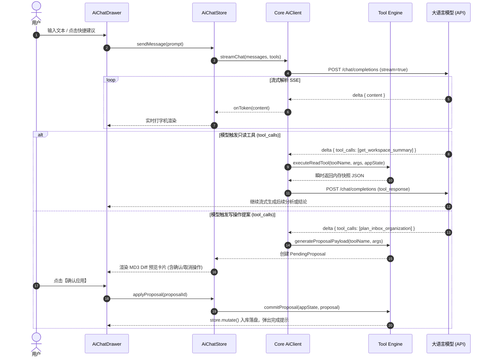

# 技术设计规格书 (Spec): TaskOrbit AI Agent 任务助理

## 1. 概述与设计原则 (Overview & Principles)

本规格书基于 [prd.md](file:///d:/CS/TaskOrbit/docs/vibe-workflow/ai-agent/prd.md) 规划，详细定义 TaskOrbit 接入大语言模型（LLM）并构建智能任务管理 Agent 的技术实现路径。

### 设计原则
1. **本地优先与强一致性**：所有数据操作完全遵循 TaskOrbit 单一不可变 `AppState` 规范，写操作均通过 `core/domain.ts` 的纯函数和 Zod 校验，杜绝非法状态落盘。
2. **人机协同安全（Human-in-the-Loop）**：读操作自动执行以保证流畅度，写操作强制通过结构化 Diff 预览卡片让用户核对确认后再调用 `mutate` 写入，杜绝模型幻觉可能造成的数据破坏。
3. **零外部框架依赖与跨平台解耦**：模型通信基于原生 `fetch` 与 SSE（Server-Sent Events）标准流式解析，不引入体积臃肿的第三方 Agent SDK；核心协议、工具定义、上下文提取与提案生成下沉至 `@task-orbit/core`，供桌面端（React）与后续移动端（React Native）直接复用。
4. **严格遵循 MD3 设计语言**：桌面端 UI 深度结合 Material Design 3 令牌系统，自适应暗色/浅色模式，与应用现有视觉与动效保持完全一致。

---

## 2. 影响模块与接口定义 (Affected Modules & Interfaces)

### 2.1 模块全景

```
packages/core/src/
├── types.ts                    # 新增 AiSettings、AiTool 等数据类型
├── version.ts                  # STATE_VERSION 8 -> 9
├── migrations.ts               # migrateV8ToV9 迁移逻辑
├── schemaDefaults.ts           # DEFAULT_AI_SETTINGS 默认值
├── schema.ts                   # aiSettingsSchema 与 AppState 校验
├── transfer.ts                 # 导出备份脱敏（清除 apiKey）
└── ai/                         # 【新增】核心 AI Agent 模块
    ├── types.ts                # 对话消息、工具定义、Proposal 结构类型
    ├── presets.ts              # DeepSeek, SiliconFlow, OpenAI, Ollama 预设
    ├── client.ts               # 原生 Fetch SSE 流式客户端与 AbortController 管理
    ├── tools.ts                # OpenAI 兼容 Function Calling 工具元数据定义
    ├── executor.ts             # 只读工具执行引擎（直读 AppState）
    ├── proposals.ts            # 提案数据构造器与数据转换器
    └── index.ts                # 统一导出

src/
├── store/
│   ├── store.tsx               # 暴露 updateAiSettings、执行 Proposals 的包装
│   └── ai-chat-store.tsx       # 【新增】AI 会话上下文（流式状态、消息历史、取消、重试）
├── components/
│   ├── Layout.tsx              # 顶栏右侧新增 AI 侧边栏唤起按钮
│   ├── forms.tsx / material.tsx# 预置组件消费
│   └── ai/                     # 【新增】AI 相关业务组件
│       ├── AiChatDrawer.tsx    # MD3 规范可折叠侧边栏
│       ├── AiMessageList.tsx   # 对话消息流、打字机动画、状态胶囊
│       ├── AiProposalCard.tsx  # 增量 Diff 预览与交互式确认卡片
│       ├── AiQuickActions.tsx  # 快捷指令建议胶囊
│       └── AiSettingsDialog.tsx# 模型配置表单与连通性测试面板
└── views/
    ├── InboxView.tsx           # 头部操作区接入“AI 智能整理”快捷入口
    ├── CalendarView.tsx        # 头部操作区接入“AI 智能排期”快捷入口
    └── StatsView.tsx           # 统计概览接入“AI 效能反思”快捷入口
```

---

## 3. 数据模型与版本升级 (Data Model & Migrations)

### 3.1 类型定义 (`packages/core/src/types.ts`)

```typescript
export type AiProviderKey = "deepseek" | "siliconflow" | "openai" | "ollama" | "custom";

export interface AiSettings {
  enabled: boolean;
  provider: AiProviderKey;
  baseUrl: string;
  apiKey: string;
  model: string;
  temperature: number; // 0.0 - 1.0, 默认 0.7
}

export interface AppState {
  version: number;
  projects: Project[];
  tasks: Task[];
  dailyPlans: DailyPlan[];
  inboxItems: InboxItem[];
  pomodoroSessions: PomodoroSession[];
  settings: Settings;
  vaultSettings: VaultSettings;
  activeTimer: ActiveTimer | null;
  webDavSettings: WebDavSettings;
  aiSettings: AiSettings; // 【v9 新增】
}
```

### 3.2 默认配置 (`packages/core/src/schemaDefaults.ts`)

```typescript
export const DEFAULT_AI_SETTINGS: AiSettings = {
  enabled: false,
  provider: "deepseek",
  baseUrl: "https://api.deepseek.com/v1",
  apiKey: "",
  model: "deepseek-chat",
  temperature: 0.7,
};
```

### 3.3 数据迁移与脱敏
1. **版本升级**：`packages/core/src/version.ts` 中 `STATE_VERSION = 9`。
2. **迁移链条**：在 `migrations.ts` 添加 `migrateV8ToV9`：
   ```typescript
   function migrateV8ToV9(input: JsonRecord): JsonRecord {
     return {
       ...input,
       version: STATE_VERSION,
       aiSettings: { ...DEFAULT_AI_SETTINGS, ...asRecord(input.aiSettings) },
     };
   }
   ```
3. **导出脱敏**：在 `packages/core/src/transfer.ts` 的 `serializeExportSnapshot` 中：
   ```typescript
   const { apiKey: _apiKey, ...portableAiSettings } = state.aiSettings;
   // 导出状态中抹除明文 Key
   aiSettings: {
     ...portableAiSettings,
     apiKey: "",
   }
   ```

---

## 4. Agent 工具调用与执行引擎设计 (Tools & Execution Engine)

### 4.1 工具清单与元数据 (`packages/core/src/ai/tools.ts`)

符合 OpenAI Tool Calling 规范：

| 工具名称 | 类型 | 描述 | 参数 Schema |
| :--- | :--- | :--- | :--- |
| `get_workspace_summary` | 只读 (自动执行) | 获取工作区概况（项目列表、今日计划、未处理收集箱数、活跃番茄钟） | `{}` |
| `get_inbox_items` | 只读 (自动执行) | 查询未完成或全部收集箱条目 | `{ kind?: "todo" \| "note", done?: boolean }` |
| `get_projects_and_tasks` | 只读 (自动执行) | 查询指定项目或全局所有任务状态 | `{ projectId?: string, includeDone?: boolean }` |
| `get_daily_plans` | 只读 (自动执行) | 查询指定日期范围内的日程计划时间块 | `{ startDate: string, endDate: string }` |
| `get_pomodoro_stats` | 只读 (自动执行) | 聚合查询指定日期范围内的专注会话与项目耗时 | `{ days?: number, startDate?: string, endDate?: string }` |
| `plan_inbox_organization`| 写入 (提案确认) | 提议将收集箱内容整理转化为任务或每日计划，并归档原项 | `{ proposals: InboxOrganizationProposal[] }` |
| `plan_schedule_daily_plans`| 写入 (提案确认) | 提议创建、调整或顺延指定日期的计划时间块 | `{ targetDate: string, proposals: DailyPlanScheduleProposal[] }` |
| `plan_task_mutations` | 写入 (提案确认) | 提议批量创建新任务或修改既有任务属性 | `{ proposals: TaskMutationProposal[] }` |

### 4.2 写操作提案结构 (`packages/core/src/ai/types.ts`)

每个写操作工具不直接修改 `AppState`，而是返回格式化的 `ProposalAction`，结构如下：

```typescript
export interface InboxOrganizationProposal {
  inboxItemId: string;
  sourceContent: string;
  action: "convert_to_task" | "convert_to_daily_plan" | "mark_done" | "dismiss";
  targetProjectName?: string;
  taskData?: {
    projectId: string;
    name: string;
    description: string;
    startDate: string;
    endDate: string;
    priority: Priority;
  };
  dailyPlanData?: {
    projectId: string | null;
    taskId: string | null;
    name: string;
    description: string;
    date: string;
    startTime: string;
    endTime: string;
    estimatedMinutes: number;
  };
}

export interface DailyPlanScheduleProposal {
  action: "create" | "reschedule" | "delete";
  planId?: string; // reschedule 时必填
  originalTime?: { startTime: string; endTime: string };
  newPlan: {
    projectId: string | null;
    taskId: string | null;
    name: string;
    date: string;
    startTime: string;
    endTime: string;
    estimatedMinutes: number;
  };
  reason: string;
}
```

---

## 5. 核心交互流程与时序 (Key Workflows)

### 5.1 对话与工具调度循环 (Agent Execution Loop)



### 5.2 快捷动作与上下文注入 (Contextual Shortcuts)

- **收集箱一键整理**：点击头部【AI 整理】按钮，自动展开侧边栏并注入上下文提示词：
  > *"请检索当前收集箱中未处理的内容，并结合我现有的项目结构，帮我归纳整理，生成转化为任务或每日计划的调整提案。"*
- **日历智能排期**：在日历视图点击【AI 智能排期】：
  > *"请查看我今天（YYYY-MM-DD）的已有日程与未完成任务，识别出空闲时间段，帮我推荐最合理的每日计划时间块排期。"*
- **效能复盘反思**：在统计视图点击【AI 效能反思】：
  > *"请分析我过去 7 天的番茄钟专注会话与每日计划完成情况，评估时间分配偏差与专注节奏，并给出改进建议。"*

---

## 6. UI 与组件设计规范 (Material Design 3)

### 6.1 `AiChatDrawer` (侧边栏)
- **定位与尺寸**：右侧停靠，宽度 380px，支持在小屏时自动全宽覆盖或在宽屏时内容自适应挤压。
- **视觉风格**：
  - 容器背景采用 `var(--md-surface-container-low)`；
  - 顶栏采用 `var(--md-surface-container)`，包含“AI 助理”标题、当前模型 Badge（如 `DeepSeek-V3`）、清空会话按钮、配置快捷图标与关闭图标。
  - 用户气泡：`var(--md-primary-container)`，文字 `var(--md-on-primary-container)`，右侧圆角自适应。
  - 助手气泡：`var(--md-surface-container-high)`，支持 Markdown 渲染（段落、列表、代码块加粗等）。

### 6.2 `AiProposalCard` (变更确认卡片)
- 遵循 MD3 `OutlinedCard` 规范，具有微妙的 `var(--md-outline-variant)` 边框。
- 卡片内部清晰列出变更详情：
  - **分类转化类**：左侧显示原收集箱条目文本，右侧带箭头指示目标项目名称、提取的起止日期及优先级 Badge。
  - **排期调整类**：展示时间区间（如 `09:30 - 10:30 → 14:00 - 15:00`），标注调整理由。
- 底部配备明确的操作按钮：
  - `FilledButton`（强调色）：【确认应用变更】
  - `TextButton`：【放弃】

### 6.3 `AiSettingsDialog` (配置弹窗)
- 集成常用厂商下拉（预填 Base URL 与模型名）：
  - DeepSeek (`https://api.deepseek.com/v1`, `deepseek-chat`)
  - SiliconFlow (`https://api.siliconflow.cn/v1`, `deepseek-ai/DeepSeek-V3`)
  - OpenAI (`https://api.openai.com/v1`, `gpt-4o-mini`)
  - Ollama 本地 (`http://localhost:11434/v1`, `qwen2.5:7b`)
  - 自定义 OpenAI 兼容
- 字段校验：Base URL 必须为有效 HTTP/HTTPS URL；
- 配备【测试连通性】按钮：点击向端点发送单次轻量探测请求，成功显示绿色勾选 Badge，失败显示具体 HTTP 错误或网络超时说明。

---

## 7. 错误处理与边缘用例 (Error Handling & Edge Cases)

1. **未配置 API Key**：
   - 用户在侧边栏发起对话时，若未配置或未启用 AI，气泡提示“请先配置大模型 API Key”，并提供直接呼出设置弹窗的快捷按钮。
2. **网络超时与网络断开**：
   - 默认请求超时时间为 30s。若超时或断网，UI 显示错误横幅，并附带【重试】按钮，不丢失当前输入内容。
3. **模型输出非预期格式 / 工具解析失败**：
   - 若模型未能严格返回合法 JSON 参数，工具解析器捕获异常，将其包装为自然语言反馈给模型重新生成，或直接向用户呈现原始建议文本，避免应用崩溃。
4. **用户正在生成时关闭抽屉**：
   - 抽屉折叠后，后台流式继续接收，重新打开依然保留最新生成内容；用户点击【停止】时，触发 `AbortController.abort()` 立即释放网络连接。

---

## 8. 验证与测试方案 (Verification Plan)

### 8.1 单元测试 (`packages/core/src/ai/*.test.ts`)
- **数据迁移测试**：校验 `migratePersistedState` 能将 v8 及历史数据平滑升至 v9，`aiSettings` 具有正确默认值。
- **脱敏校验测试**：校验 `serializeExportSnapshot` 输出中 `aiSettings.apiKey` 为清空状态。
- **只读工具纯函数测试**：给定固定的 mock `AppState`，验证 `get_workspace_summary`、`get_inbox_items`、`get_daily_plans` 返回结构精确无误。
- **提案应用测试**：测试 `commitProposal` 在处理不同类型的提案（创建任务、修改排期、归档收集箱）后，返回的新 `AppState` 完全通过 Zod 校验。

### 8.2 桌面端集成验证
- **设置测试**：配置测试 Key 或本地 Mock 端点，连通性测试通过。
- **场景端到端验证**：
  1. 收集箱创建 2 条测试待办，触发 AI 整理，确认生成卡片并点击应用，检查项目视图对应任务是否成功生成。
  2. 请求排期今日日程，确认卡片后检查日历视图时间块是否渲染。
  3. 请求效能分析，检查番茄钟时长与统计分析是否符合实际数据。
- **构建与健康检查**：运行 `pnpm build` 和 `pnpm test`，保证无编译错误与测试退化。
